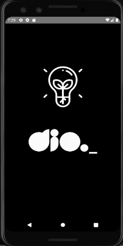

# Projeto App Lanterna
Projeto desenvolvido em React Native de um app que acende a lanterna do smartphone através do toque na tela ou do sensor de movimento

### Meus comentários
Este projeto faz parte do bootcampo Decola Tech 3 da Digital Inovation One, é meu primeiro contato com React Native e desenvolvimento de aplicação mobile, aprendi conceitos importantes como Setup do ambiente de desenvolviemnto, emulador de dispositivos, Hooks, StyleSheet, LifeCicly dos componentes, além de utilizar a documentação oficial como ferramenta de apoio. Utilizei o VS Code para desenvolver o código.

